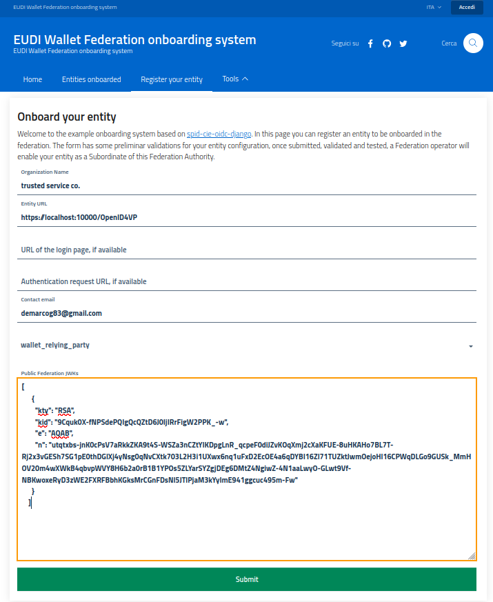
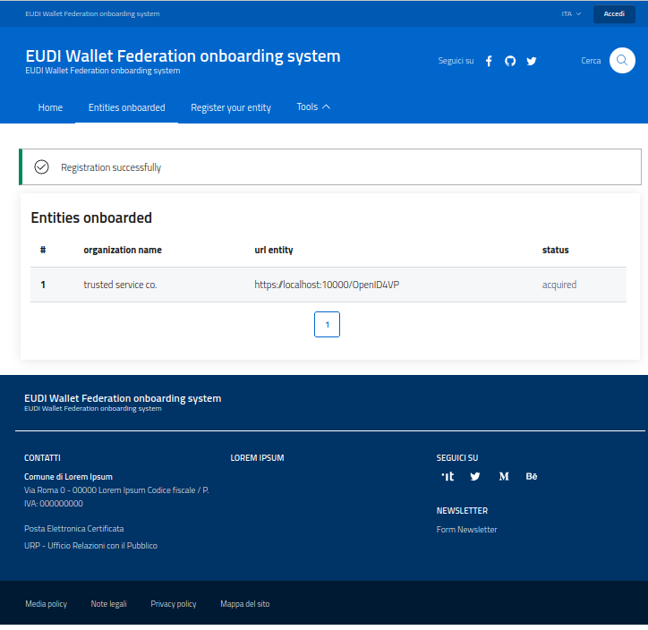
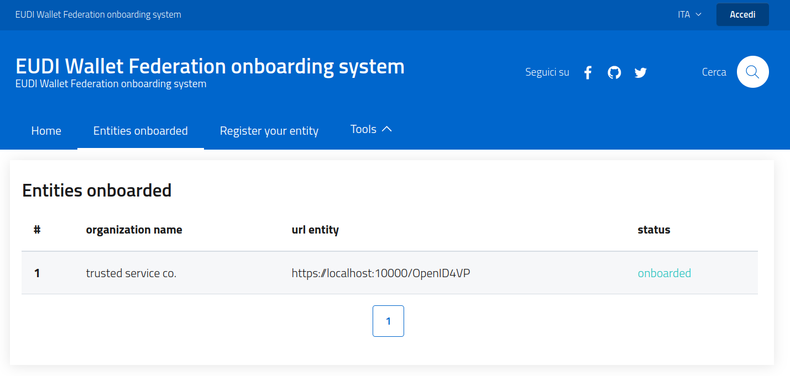

# EUDI Wallet Federation onboarding tutorial


In this document are illustrated the steps to get a fully working onboarding and trust anchor demo.
The sections identified with the prefix **[FedOp]** are related to the Federation operators that
accreditate the subordinates. The sections identified with the prefix **[User]** are 
related to the User that asks to get a specific Entity onboarded within the onboarding service.

## [FedOp] Configure the Trust Anchor

For demo purpose you can even import the backup files located in the [dumps](dumps) 
folder, containing a demo Trust Anchor setup.

Generally, an admin that configures this project creates the schemas, creates a superuser to access to the admin backend and then imports the backup of the demo configuration.
````
./manage.py migrate
./manage.py createsuperuser
./manage.py loaddata dumps/$dumpfile.json
````

## [User] Onboard an entity

Go to [the onboarding demo service](127.0.0.1:8000/onboarding/landing) and click
on the button `Register your entity`.

### [User] Fill the form

Fill the form field as show in the picture below.



Then click on the button `Submit`. If the validation of the Entity's configuration passes,
the User will be redirected to the onboarding status page, as shown below:


 
Now the onboarding request is verified and accepted, then it requires an 
administrative validation from the Federation operators.

### [FedOp] enable the descendant

The admins of the platform checks the pending onboarding requests and then
selects the ones that are eligible to be subordinates of the Trust Anchor.


### [User] obtain the Entity Statement

The onboarding request appears as completed with success.



Then the User connects to 
[the fetch endpoint](http://127.0.0.1:8000/fetch?sub=https://localhost:10000/OpenID4VP&anchor=http://127.0.0.1:8000)
and obtains the entity statement related to the onboarded Entity as a proof of the fully operational setup.

Below an example of Entity Statement, with the minimum set of attributes made available, according to OIDC Federation 1.0 and this demo.

````
{
  "exp": 1690907465,
  "iat": 1690734665,
  "iss": "http://127.0.0.1:8000",
  "sub": "https://localhost:10000/OpenID4VP",
  "jwks": {
    "keys": [
      {
        "kty": "RSA",
        "kid": "9Cquk0X-fNPSdePQIgQcQZtD6J0IjIRrFigW2PPK_-w",
        "e": "AQAB",
        "n": "utqtxbs-jnK0cPsV7aRkkZKA9t4S-WSZa3nCZtYIKDpgLnR_qcpeF0diJZvKOqXmj2cXaKFUE-8uHKAHo7BL7T-Rj2x3vGESh7SG1pE0thDGlXj4yNsg0qNvCXtk703L2H3i1UXwx6nq1uFxD2EcOE4a6qDYBI16Zl71TUZktJwmOejoHl16CPWqDLGo9GUSk_MmHOV20m4wXWkB4qbvpWVY8H6b2a0rB1B1YPOs5ZLYarSYZgjDEg6DMtZ4NgiwZ-4N1aaLwyO-GLwt9Vf-NBKwoxeRyD3zWE2FXRFBbhKGksMrCGnFDsNl5JTlPjaM3kYyImE941ggcuc495m-Fw"
      }
    ]
  },
  "source_endpoint": "http://127.0.0.1:8000/fetch"
}
````

